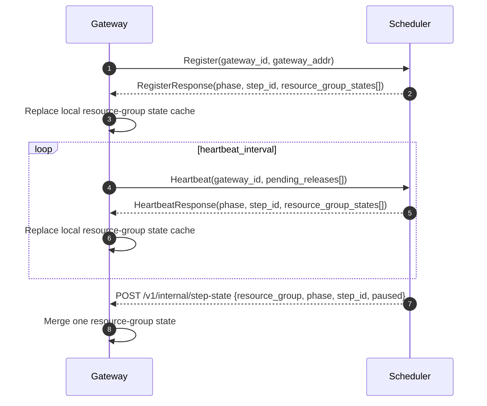
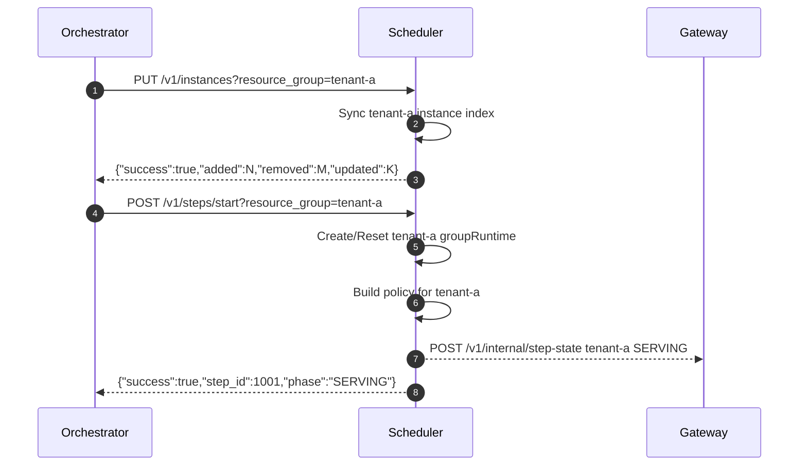
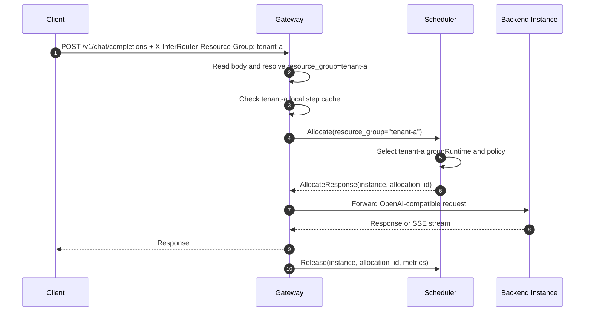
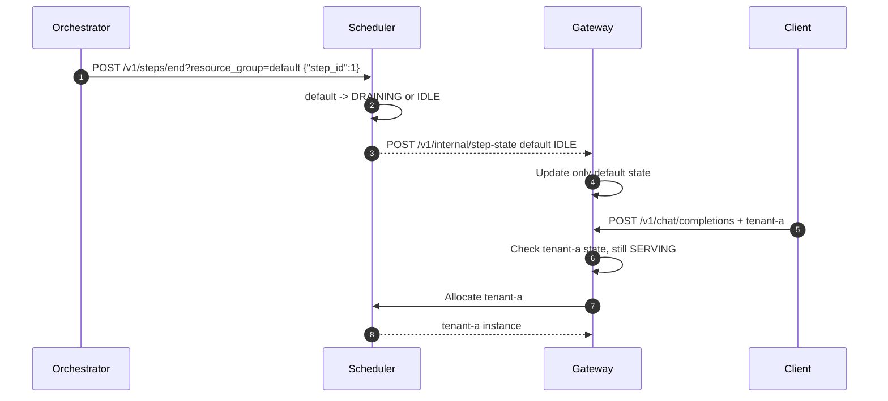
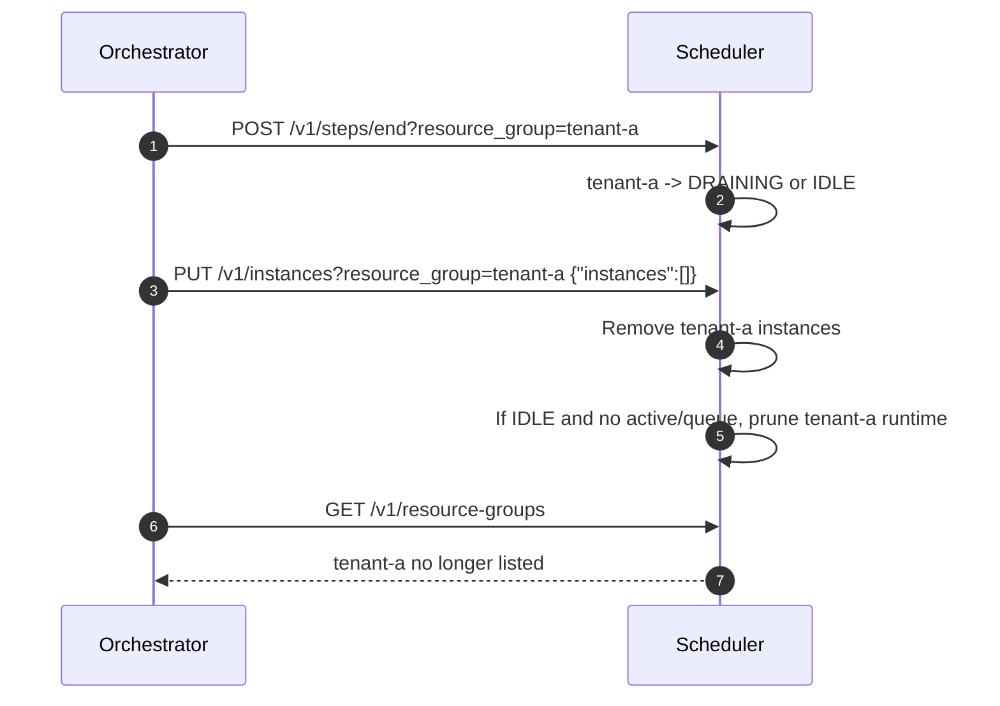

# OneRouter 多租户资源组使用手册

本文面向训练平台、实验编排器和运维脚本，说明如何在 OneRouter 中用资源组承载多租户、多实验或多 rollout 任务。

资源组是调度隔离边界。每个资源组有独立的实例集合、step 状态、pause 状态、调度策略、等待队列和 `max_inflight` 限流。`default` 是兼容旧客户端的默认资源组。

## 1. 核心概念

| 概念 | 说明 |
|------|------|
| Resource Group | 资源组，也就是多租户隔离单元。协议字段统一使用 `resource_group`。 |
| `default` | 未显式指定资源组时使用的默认组，兼容单租户旧调用。 |
| Instance | 推理后端实例，例如 sglang、vLLM、FastDeploy、OpenAI-compatible backend。 |
| Step | 一轮推理生命周期，状态为 `IDLE`、`SERVING`、`DRAINING`。 |
| Policy | 调度策略，在 `POST /v1/steps/start` 中按资源组指定。 |
| Gateway | 数据面入口，解析请求的资源组，调用 Scheduler 分配实例，然后转发请求。 |
| Scheduler | 控制面和全局调度器，维护所有资源组状态。 |

资源组选择优先级在控制面和数据面保持一致：

1. Header: `X-InferRouter-Resource-Group`
2. Query: `resource_group`
3. Body 顶层: `resource_group`
4. Body 嵌套: `metadata.resource_group`
5. 默认: `default`

推荐约定：

- 控制面脚本优先使用 query，例如 `?resource_group=tenant-a`。
- 数据面推理请求优先使用 header，例如 `X-InferRouter-Resource-Group: tenant-a`。
- 如果上游只能改 body，可使用顶层 `resource_group` 或 `metadata.resource_group`。

## 2. 生命周期总览

资源组不需要单独注册接口，生命周期是隐式的：

1. 写入实例或启动 step 时，资源组被创建。
2. 资源组进入 `SERVING` 后，Gateway 才会接受该组流量。
3. `pause` 暂停一个资源组，不影响其他资源组。
4. `end` 停止一个资源组，进入 `DRAINING` 或 `IDLE`，不影响其他资源组。
5. 删除该组全部实例，且组已 `IDLE`、无 active、无等待队列后，Scheduler 自动清理非 `default` 资源组 runtime。

只有 `steps/start` 会隐式创建资源组 runtime。`pause`、`continue`、`end` 对不存在的资源组返回 `404`；推理 allocate 遇到无实例且无 runtime 的未知资源组会被 Scheduler 拒绝，不会创建空 runtime。

典型操作顺序：

```bash
# 1. 同步 tenant-a 的实例集合
curl -X PUT "http://$SCHEDULER/v1/instances?resource_group=tenant-a" \
  -H "Content-Type: application/json" \
  -d '{"instances":[{"id":"a-0","host":"10.0.0.1","port":8000,"gpu_num":8}]}'

# 2. 启动 tenant-a 推理轮次，并选择独立策略
curl -X POST "http://$SCHEDULER/v1/steps/start?resource_group=tenant-a" \
  -H "Content-Type: application/json" \
  -d '{"step_id":1001,"policy":"session_aware_v5","max_inflight":200}'

# 3. 请求 tenant-a
curl -X POST "http://$GATEWAY/v1/chat/completions" \
  -H "Content-Type: application/json" \
  -H "X-InferRouter-Resource-Group: tenant-a" \
  -d '{"model":"demo","messages":[{"role":"user","content":"hello"}]}'

# 4. 停止 tenant-a
curl -X POST "http://$SCHEDULER/v1/steps/end?resource_group=tenant-a" \
  -H "Content-Type: application/json" \
  -d '{"step_id":1001}'

# 5. 注销 tenant-a 的实例集合
curl -X PUT "http://$SCHEDULER/v1/instances?resource_group=tenant-a" \
  -H "Content-Type: application/json" \
  -d '{"instances":[]}'
```

## 3. 调用时序图

### 3.1 Gateway 启动和资源组状态同步

Gateway 启动后通过 gRPC 向 Scheduler 注册，随后心跳持续同步全量资源组 step 状态。控制面 step 变化还会通过 HTTP push 做增量同步。



### 3.2 准备资源组并启动推理

实例集合和 step 策略分开管理。`PUT /v1/instances` 管资源清单，`POST /v1/steps/start` 管本轮调度行为。



### 3.3 推理请求路由

Gateway 会先解析资源组，再按该组本地 step cache 做快速判断。未知的非 `default` 资源组不会被 gateway 提前拒绝，会交给 Scheduler event-loop 做真实判断。



### 3.4 停止 default 不影响其他资源组

`default` 只是一个资源组，不是全局开关。停止 `default` 后，Gateway 会更新 `default` cache；其他仍为 `SERVING` 的资源组继续接收请求。



### 3.5 注销资源组

资源组没有单独 `DELETE /v1/resource-groups/{group}`。通过同步空实例集合完成注销，Scheduler 在安全条件满足时自动清理 runtime。



## 4. 外部控制面 HTTP 协议

所有控制面接口由 Scheduler 提供，默认 JSON 编码。

通用规则：

- `Content-Type: application/json`
- 成功通常返回 `200 OK`
- 参数非法返回 `400 Bad Request`
- 状态冲突返回 `409 Conflict`
- event-loop 或内部依赖不可用返回 `503 Service Unavailable`

### 4.1 资源组选择

控制面接口都支持以下 selector：

```http
X-InferRouter-Resource-Group: tenant-a
```

```http
?resource_group=tenant-a
```

```json
{"resource_group":"tenant-a"}
```

```json
{"metadata":{"resource_group":"tenant-a"}}
```

如果多个位置同时提供，以 header、query、body 顶层、metadata 的顺序生效。

### 4.2 列出资源组

```http
GET /v1/resource-groups
```

响应：

```json
{
  "resource_groups": ["default", "tenant-a", "tenant-b"]
}
```

说明：

- 返回实例索引和 runtime 中已知的资源组。
- 未知组的 state 查询不会创建资源组。
- 非 `default` 组在空闲且无实例时会被自动清理。

### 4.3 查询实例

```http
GET /v1/instances?resource_group=tenant-a
```

响应：

```json
{
  "instances": [
    {
      "id": "a-0",
      "endpoint": "10.0.0.1:8000",
      "metrics_endpoint": "10.0.0.1:8000",
      "gpu_num": 8,
      "resource_group": "tenant-a"
    }
  ]
}
```

说明：

- 带 selector 时只查询该资源组。
- 不带 selector 时查询全局实例表。

### 4.4 追加或更新实例

```http
POST /v1/instances?resource_group=tenant-a
```

请求：

```json
{
  "instances": [
    {
      "id": "a-0",
      "host": "10.0.0.1",
      "port": 8000,
      "metrics_port": 8001,
      "gpu_num": 8,
      "total_kv_blocks": 120000,
      "model_version": 1001,
      "labels": {
        "zone": "az-a"
      }
    }
  ]
}
```

响应：

```json
{
  "success": true,
  "registered_count": 1
}
```

字段说明：

| 字段 | 必填 | 说明 |
|------|------|------|
| `id` | 是 | 实例唯一 ID。 |
| `host` | 是 | 后端实例 host，不含端口。 |
| `port` | 是 | 推理服务端口。 |
| `metrics_port` | 否 | 指标端口；未填时使用 `port`。 |
| `gpu_num` | 是 | GPU 数量，用于权重和容量描述。 |
| `total_kv_blocks` | 否 | KV cache 容量，cache-aware 策略使用。 |
| `model_version` | 否 | 模型版本或训练 step，可用于版本观测。 |
| `resource_group` | 否 | 实例所属资源组；请求 selector 存在时必须为空或与 selector 一致。 |
| `labels` | 否 | 其他元数据；`labels.resource_group` 不参与调度归属。 |

说明：

- 带 selector 时，所有实例都会被归入该资源组；若实例显式 `resource_group` 与 selector 不一致，返回 `400 Bad Request`。
- 同一个 instance ID 不能跨资源组 upsert；如果 ID 已属于其他组，返回 `409 Conflict`，需要先从旧组注销再注册到新组。
- 不带 selector 时，按实例自身 `resource_group` 注册；未设置时进入 `default`。
- `POST` 是 upsert，不会删除该组内未出现的旧实例。

### 4.5 原子同步实例集合

```http
PUT /v1/instances?resource_group=tenant-a
```

请求：

```json
{
  "instances": [
    {"id":"a-0","host":"10.0.0.1","port":8000,"gpu_num":8},
    {"id":"a-1","host":"10.0.0.2","port":8000,"gpu_num":8}
  ]
}
```

响应：

```json
{
  "success": true,
  "added": 1,
  "removed": 0,
  "updated": 1
}
```

说明：

- 带 selector 时，只替换该资源组实例集合，不影响其他组。
- 不带 selector 时，替换全局实例表。
- 同步空数组可用于注销资源组实例：

```bash
curl -X PUT "http://$SCHEDULER/v1/instances?resource_group=tenant-a" \
  -H "Content-Type: application/json" \
  -d '{"instances":[]}'
```

### 4.6 删除实例

```http
DELETE /v1/instances?resource_group=tenant-a
```

请求：

```json
{
  "ids": ["a-0", "a-1"]
}
```

响应：

```json
{
  "success": true,
  "unregistered_count": 2
}
```

说明：

- 删除是幂等的；不存在的 ID 不算错误。
- 带 selector 时，只删除当前属于该资源组的实例。
- 不带 selector 时，按 ID 全局删除。

### 4.7 启动资源组推理

```http
POST /v1/steps/start?resource_group=tenant-a
```

请求：

```json
{
  "step_id": 1001,
  "policy": "session_aware_v5",
  "max_inflight": 200,
  "max_request_load": 64,
  "waiting_queue_enabled": true,
  "waiting_queue_max_size": 10000,
  "waiting_queue_timeout_sec": 300
}
```

响应：

```json
{
  "success": true,
  "step_id": 1001,
  "phase": "SERVING",
  "policy": "session_aware_v5",
  "max_request_load": 64,
  "max_inflight": 200
}
```

常用字段：

| 字段 | 必填 | 说明 |
|------|------|------|
| `step_id` | 是 | 推理轮次 ID。 |
| `policy` | 否 | 调度策略。为空时复用当前资源组 policy 并 reset。 |
| `max_inflight` | 否 | 当前资源组 in-flight 上限。 |
| `max_request_load` | 否 | 单实例 active/load 上限。 |
| `waiting_queue_enabled` | 否 | 是否开启等待队列。 |
| `waiting_queue_max_size` | 否 | 等待队列最大长度。 |
| `waiting_queue_timeout_sec` | 否 | 等待队列超时秒数。 |
| `max_session_load` | 否 | session-aware 策略使用。 |
| `load_diff_threshold` | 否 | session-aware 策略负载差阈值。 |
| `cache_threshold` | 否 | cache-aware 策略命中阈值。 |
| `cache_block_size` | 否 | cache-aware radix/cache block 大小。 |
| `hit_ratio_weight` | 否 | cache 命中权重。 |
| `load_balance_weight` | 否 | 负载均衡权重。 |
| `balance_abs_threshold` | 否 | 绝对负载差阈值。 |
| `balance_rel_threshold` | 否 | 相对负载差阈值。 |
| `max_tree_size` | 否 | cache-aware tree 大小上限。 |
| `eviction_interval_sec` | 否 | cache-aware 清理间隔。 |

可用 policy 名称：

| Policy | 适用场景 |
|--------|----------|
| `min_load` | 默认策略，按综合负载选择。 |
| `min_request` | 按 active request 数选择。 |
| `round_robin` | 轮询，适合简单验证。 |
| `session_aware` | 基础 session 亲和。 |
| `session_aware_v3` | session 亲和增强版。 |
| `session_aware_v4` | 支持更多 session/load 控制。 |
| `session_aware_v5` | 推荐的 session-aware 版本。 |
| `cache_aware` | 利用请求文本前缀 cache 命中。 |
| `process_tokens` | PD 或 token 处理量相关场景。 |
| `request_num` | PD decode 默认请求数策略。 |
| `pd_cache_aware` | PD prefill cache-aware 默认策略。 |

示例：两个租户使用不同策略：

```bash
curl -X POST "http://$SCHEDULER/v1/steps/start?resource_group=tenant-a" \
  -H "Content-Type: application/json" \
  -d '{"step_id":1001,"policy":"session_aware_v5","max_inflight":200}'

curl -X POST "http://$SCHEDULER/v1/steps/start?resource_group=tenant-b" \
  -H "Content-Type: application/json" \
  -d '{"step_id":2001,"policy":"cache_aware","cache_block_size":32,"max_inflight":80}'
```

### 4.8 停止资源组推理

```http
POST /v1/steps/end?resource_group=tenant-a
```

请求：

```json
{
  "step_id": 1001
}
```

响应：

```json
{
  "success": true,
  "step_id": 1001,
  "phase": "DRAINING",
  "pending_requests": 17
}
```

说明：

- 如果没有在途请求，直接返回 `IDLE`。
- 如果仍有在途请求，进入 `DRAINING`，等待 release 后自动变 `IDLE`。
- 只影响指定资源组。
- 停止 `default` 不影响其他显式资源组。

### 4.9 暂停和恢复资源组

暂停：

```http
POST /v1/steps/pause?resource_group=tenant-a
```

响应：

```json
{
  "success": true,
  "paused": true,
  "step_id": 1001
}
```

恢复：

```http
POST /v1/steps/continue?resource_group=tenant-a
```

响应：

```json
{
  "success": true,
  "paused": false,
  "step_id": 1001
}
```

说明：

- pause 只暂停该资源组的新分配。
- 已在途请求不会被强制中断。
- pause 会清空该资源组等待队列，排队请求收到暂停错误。
- Chat Completions 在 pause 场景下会尽量返回协议兼容的 abort 响应。

### 4.10 查询资源组 step 状态

```http
GET /v1/steps/current?resource_group=tenant-a
```

响应：

```json
{
  "step_id": 1001,
  "phase": "SERVING",
  "paused": false,
  "registered_gateways": {
    "10.0.1.10:8080": {
      "gateway_id": "10.0.1.10:8080",
      "gateway_addr": "10.0.1.10:8080"
    }
  }
}
```

说明：

- 带 selector 时查询该资源组。
- 不带 selector 时查询旧单组视图，也就是 `default`。
- 查询未知资源组返回 `IDLE` 快照，但不会创建资源组。

### 4.11 V2 兼容控制面

V2 兼容层不新增资源组专用接口。现有 V2 接口只做字段和响应信封适配，底层与 V1 控制面复用同一套 `internal/controlplane` 命令：

| V2 API | 对齐的 V1 语义 |
|--------|----------------|
| `POST /api/v2/start_infer` | `POST /v1/steps/start` |
| `POST /api/v2/stop_infer` | `POST /v1/steps/end` |
| `PUT /api/v2/instances` | `PUT /v1/instances` |
| `POST /api/v2/session_finish` | 按资源组清理 session 绑定 |
| `POST /api/v2/chat/completions` | V2 兼容数据面推理 |

资源组 selector 与 V1 完全一致，优先级仍是 header、query、body 顶层、`metadata.resource_group`。不带 selector 时操作 `default`。

示例：

```bash
curl -X PUT "http://$SCHEDULER/api/v2/instances?resource_group=tenant-a" \
  -H "Content-Type: application/json" \
  -d '{"instances":[{"id":"a-0","host":"10.0.0.1","infer_port":8000,"gpu_num":8}]}'

curl -X POST "http://$SCHEDULER/api/v2/start_infer?resource_group=tenant-a" \
  -H "Content-Type: application/json" \
  -d '{"model_version":1001,"load_balance_policy":"session_aware_v5","max_inflight":200}'

curl -X POST "http://$SCHEDULER/api/v2/stop_infer?resource_group=tenant-a"
```

说明：

- `start_infer.model_version` 映射为 V1 的 `step_id`。
- `stop_infer` 兼容旧客户端空 body：按该资源组最近一次 `start_infer` 缓存的 step ID 结束；也可在 body 中显式传 `step_id` 或 `model_version`。
- `stop_infer` 会等待当前资源组从 `DRAINING` 自动进入 `IDLE` 后再返回成功；V1 `/v1/steps/end` 仍立即返回 `DRAINING` 和 `pending_requests`。
- `PUT /api/v2/instances` 带 selector 时只同步该资源组，不会删除其他资源组实例；若实例显式 `resource_group` 与 selector 冲突，返回 V2 error envelope。
- V2 响应仍保持 HTTP 200 + `{"status":{"code":...,"message":"..."}}`。

## 5. 数据面推理协议

Gateway 支持 OpenAI-compatible 和 SGLang-native 数据面接口：

| API | 说明 |
|-----|------|
| `POST /v1/chat/completions` | OpenAI Chat Completions。 |
| `POST /api/v2/chat/completions` | V2 兼容 Chat Completions。 |
| `POST /v1/completions` | OpenAI Completions。 |
| `POST /generate` | SGLang native generate。 |

推荐用 header 传资源组：

```bash
curl -X POST "http://$GATEWAY/v1/chat/completions" \
  -H "Content-Type: application/json" \
  -H "X-InferRouter-Resource-Group: tenant-a" \
  -d '{
    "model": "demo",
    "messages": [{"role": "user", "content": "hello"}],
    "stream": true
  }'
```

也可以放在 body：

```json
{
  "model": "demo",
  "resource_group": "tenant-a",
  "messages": [{"role": "user", "content": "hello"}]
}
```

或：

```json
{
  "model": "demo",
  "metadata": {
    "resource_group": "tenant-a"
  },
  "messages": [{"role": "user", "content": "hello"}]
}
```

Gateway 处理顺序：

1. 读取请求 body。
2. 按选择优先级解析 `resource_group`。
3. 查询本地资源组 step cache。
4. 若该组不是 `SERVING`，快速拒绝。
5. 若该组本地未知且非 `default`，放行到 Scheduler。
6. 调用 Scheduler `Allocate` 或 `AllocatePD`，请求中携带显式 `resource_group`。
7. 转发到后端实例。
8. 请求结束后调用 `Release` 或 `ReleasePD`。

## 6. 内部同步协议

本节用于排障和二次开发。业务方通常不需要直接调用。

### 6.1 HTTP 增量状态推送

Scheduler 在资源组 step 变化后向所有注册 gateway 推送：

```http
POST /v1/internal/step-state
```

请求：

```json
{
  "resource_group": "tenant-a",
  "phase": 1,
  "step_id": 1001,
  "paused": false
}
```

字段：

| 字段 | 说明 |
|------|------|
| `resource_group` | 资源组；为空时按 `default`。 |
| `phase` | 数字枚举：`0=IDLE`、`1=SERVING`、`2=DRAINING`。 |
| `step_id` | 当前 step ID。 |
| `paused` | 当前资源组是否暂停。 |

Gateway 收到后 merge 到本地资源组状态缓存，不会覆盖其他资源组。

### 6.2 gRPC Register

```protobuf
message RegisterResponse {
  bool success = 1;
  string message = 2;
  StepPhase phase = 3;     // legacy default state
  int64 step_id = 4;       // legacy default step id
  repeated ResourceGroupStepState resource_group_states = 5;
}
```

说明：

- `phase` 和 `step_id` 保持旧协议语义，代表 `default`。
- `resource_group_states` 是全量快照。
- Gateway register 成功后用 `resource_group_states` 替换本地状态缓存。

### 6.3 gRPC Heartbeat

```protobuf
message HeartbeatRequest {
  string gateway_id = 1;
  int64 active_connections = 2;
  int64 timestamp_ms = 3;
  repeated PendingRelease pending_releases = 4;
}

message HeartbeatResponse {
  bool success = 1;
  StepPhase phase = 2;     // legacy default state
  int64 step_id = 3;       // legacy default step id
  repeated ResourceGroupStepState resource_group_states = 4;
}
```

说明：

- Heartbeat 同步全量资源组状态，用于 gateway 重启、HTTP push 丢失或网络抖动后的恢复。
- `pending_releases` 用于投递之前释放失败的 allocation，保证负载最终一致。
- Gateway heartbeat 成功后用 `resource_group_states` 替换本地状态缓存。

## 7. 常见操作手册

### 7.1 创建一个新租户

```bash
TENANT=tenant-a

curl -X PUT "http://$SCHEDULER/v1/instances?resource_group=$TENANT" \
  -H "Content-Type: application/json" \
  -d '{
    "instances": [
      {"id":"tenant-a-0","host":"10.0.0.1","port":8000,"gpu_num":8},
      {"id":"tenant-a-1","host":"10.0.0.2","port":8000,"gpu_num":8}
    ]
  }'

curl -X POST "http://$SCHEDULER/v1/steps/start?resource_group=$TENANT" \
  -H "Content-Type: application/json" \
  -d '{"step_id":1,"policy":"min_load","max_inflight":100}'
```

### 7.2 对不同租户使用不同策略

```bash
curl -X POST "http://$SCHEDULER/v1/steps/start?resource_group=tenant-a" \
  -H "Content-Type: application/json" \
  -d '{"step_id":10,"policy":"session_aware_v5","max_session_load":64,"max_inflight":200}'

curl -X POST "http://$SCHEDULER/v1/steps/start?resource_group=tenant-b" \
  -H "Content-Type: application/json" \
  -d '{"step_id":20,"policy":"cache_aware","cache_block_size":32,"hit_ratio_weight":1.5,"load_balance_weight":0.5}'
```

### 7.3 临时暂停一个租户

```bash
curl -X POST "http://$SCHEDULER/v1/steps/pause?resource_group=tenant-a" \
  -H "Content-Type: application/json" \
  -d '{}'
```

恢复：

```bash
curl -X POST "http://$SCHEDULER/v1/steps/continue?resource_group=tenant-a" \
  -H "Content-Type: application/json" \
  -d '{}'
```

### 7.4 滚动替换一个租户的实例

用 `POST` 追加新实例：

```bash
curl -X POST "http://$SCHEDULER/v1/instances?resource_group=tenant-a" \
  -H "Content-Type: application/json" \
  -d '{"instances":[{"id":"tenant-a-2","host":"10.0.0.3","port":8000,"gpu_num":8}]}'
```

确认新实例可用后，用 `DELETE` 删除旧实例：

```bash
curl -X DELETE "http://$SCHEDULER/v1/instances?resource_group=tenant-a" \
  -H "Content-Type: application/json" \
  -d '{"ids":["tenant-a-0"]}'
```

如果已有完整目标集合，也可以用 `PUT` 一次同步：

```bash
curl -X PUT "http://$SCHEDULER/v1/instances?resource_group=tenant-a" \
  -H "Content-Type: application/json" \
  -d '{"instances":[{"id":"tenant-a-1","host":"10.0.0.2","port":8000,"gpu_num":8},{"id":"tenant-a-2","host":"10.0.0.3","port":8000,"gpu_num":8}]}'
```

### 7.5 停止并注销租户

```bash
curl -X POST "http://$SCHEDULER/v1/steps/end?resource_group=tenant-a" \
  -H "Content-Type: application/json" \
  -d '{"step_id":10}'

curl -X PUT "http://$SCHEDULER/v1/instances?resource_group=tenant-a" \
  -H "Content-Type: application/json" \
  -d '{"instances":[]}'

curl "http://$SCHEDULER/v1/resource-groups"
```

如果 `tenant-a` 仍在列表中，通常说明：

- step 还在 `DRAINING`；
- 还有 active request 未释放；
- 等待队列还没有清空；
- 该组仍有实例未删除。

### 7.6 检查一个租户是否可接流量

```bash
curl "http://$SCHEDULER/v1/steps/current?resource_group=tenant-a"
```

满足以下条件时可接收流量：

- `phase == "SERVING"`
- `paused == false`
- 资源组内至少有健康实例
- 未触发 `max_inflight` 或全局限流

进程级 readiness 使用 `/readyz`：

- Scheduler 模式：任一资源组为 `SERVING` 即 ready，`checks.step` 形如 `serving_groups=1 total_groups=2`。
- Gateway 模式：真实 `SchedulerClient` 完成 scheduler 注册连接即 ready，不再要求 `default` 资源组处于 `SERVING`。

## 8. 错误和排障

### 8.1 `scheduler not serving`

含义：

- Gateway 本地判断该资源组不是 `SERVING`；
- 或 Scheduler event-loop 判断该资源组不是 `SERVING`。

排查：

```bash
curl "http://$SCHEDULER/v1/steps/current?resource_group=tenant-a"
curl "http://$SCHEDULER/v1/resource-groups"
```

确认请求是否带了正确资源组：

```bash
curl -v "http://$GATEWAY/v1/chat/completions" \
  -H "X-InferRouter-Resource-Group: tenant-a" \
  -H "Content-Type: application/json" \
  -d '{"model":"demo","messages":[{"role":"user","content":"hello"}]}'
```

### 8.2 `scheduler paused`

含义：

- 指定资源组被 pause。

恢复：

```bash
curl -X POST "http://$SCHEDULER/v1/steps/continue?resource_group=tenant-a" -d '{}'
```

### 8.3 `resource group rate limit exceeded`

含义：

- 当前资源组达到 `max_inflight`。

处理：

- 增大 `max_inflight`，需要下一轮 `steps/start` 生效；
- 降低上游并发；
- 增加实例；
- 开启等待队列。

### 8.4 `no instances`

含义：

- 资源组没有实例；
- 或实例被同步到了其他资源组；
- 或显式 selector 与实例 `resource_group` 字段不一致，导致同步请求被拒绝。

排查：

```bash
curl "http://$SCHEDULER/v1/instances?resource_group=tenant-a"
```

### 8.5 `unknown resource group`

含义：

- 请求指定了不存在的资源组；
- 或该资源组既没有 runtime，也没有实例。

处理：

- 先同步实例：`PUT /v1/instances?resource_group=tenant-a`；
- 再启动 step：`POST /v1/steps/start?resource_group=tenant-a`；
- 对 `pause`、`continue`、`end`，确认资源组名称拼写正确。

### 8.6 default stop 误伤检查

当前实现中，`default` stop 不应拒绝其他 `SERVING` 资源组。验证：

```bash
curl -X POST "http://$SCHEDULER/v1/steps/end?resource_group=default" \
  -H "Content-Type: application/json" \
  -d '{"step_id":1}'

curl "http://$SCHEDULER/v1/steps/current?resource_group=tenant-a"

curl -X POST "http://$GATEWAY/v1/chat/completions" \
  -H "Content-Type: application/json" \
  -H "X-InferRouter-Resource-Group: tenant-a" \
  -d '{"model":"demo","messages":[{"role":"user","content":"hello"}]}'
```

如果 tenant-a 为 `SERVING` 但 gateway 仍返回 `scheduler not serving`，检查：

- Gateway 是否已升级到支持 `resource_group_states` 的版本；
- Gateway 是否收到 heartbeat；
- Scheduler 到 Gateway 的 `/v1/internal/step-state` 是否可达；
- 请求是否实际带了 `X-InferRouter-Resource-Group: tenant-a`。

## 9. 最佳实践

- 对数据面请求固定使用 `X-InferRouter-Resource-Group`，减少 body schema 依赖。
- 每个实验或租户使用独立资源组，不要复用 `default`。
- `PUT /v1/instances?resource_group=...` 用于声明式同步，适合平台控制器。
- `POST /v1/instances?resource_group=...` 用于滚动扩容或临时追加实例。
- 每轮 infer 用 `POST /v1/steps/start` 显式指定 policy 和限流参数。
- 不同资源组可以使用不同 policy；不要把 policy 塞到 instance 注册接口。
- 停止租户时先 `end`，再同步空实例集合。
- `default` 只作为旧客户端兼容组；多租户生产流量应显式指定资源组。
- 为每个资源组设置保守的 `max_inflight`，再结合全局 `global_max_inflight` 保护 Scheduler。
- 遇到状态不同步，优先看 heartbeat 和 `/v1/internal/step-state` 推送链路。
