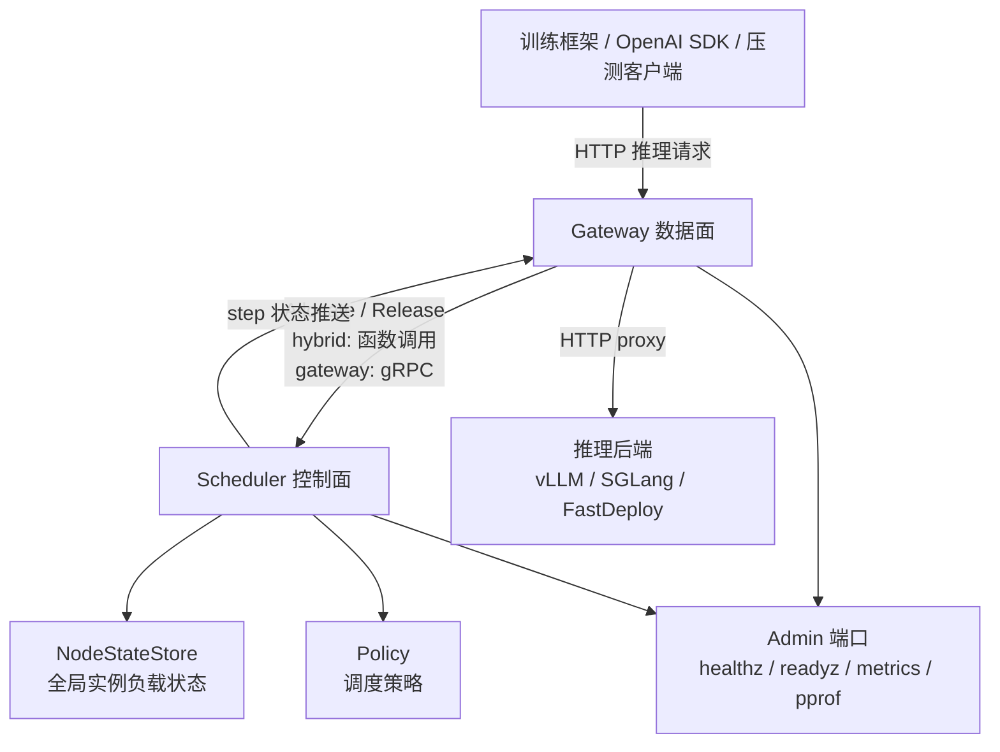
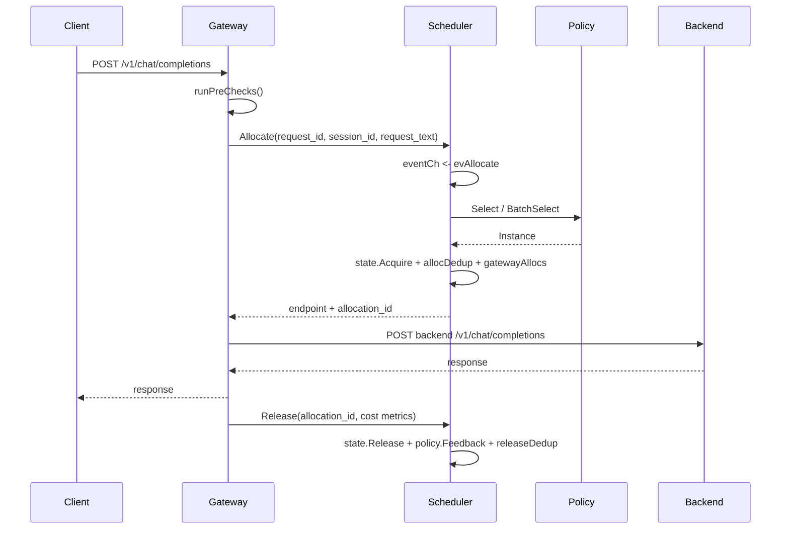
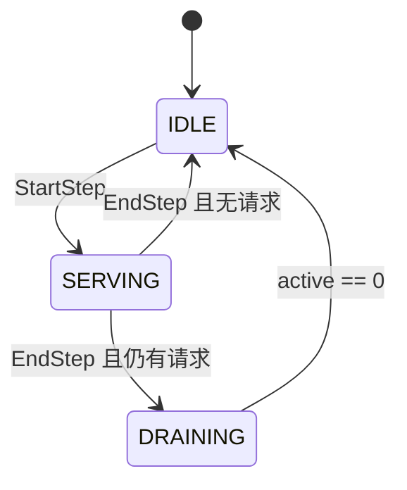
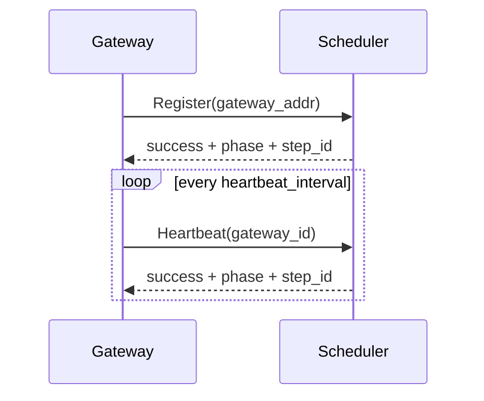

# OneRouter 详细设计与源码导读

本文面向第一次接触 OneRouter 的读者，目标是把“系统对外暴露什么、内部怎么调度、请求怎么走、配置怎么影响行为、源码从哪里读起”讲清楚。

如果只记一句话：OneRouter 是一个面向 RL rollout 推理流量的路由系统。它既能作为 gateway 接收并转发推理请求，也能作为 scheduler 维护全局后端负载并做调度；默认 `hybrid` 模式会把两者放在同一个进程里。

## 1. 系统角色

OneRouter 进程可以按 `mode` 运行成三种形态：

| 模式 | 进程内组件 | 典型用途 | 调度调用方式 |
|------|------------|----------|--------------|
| `hybrid` | gateway + scheduler | 本地开发、小规模单节点验证 | 进程内函数调用 |
| `scheduler` | scheduler | 独立控制面，维护全局实例和负载状态 | 对外提供 HTTP 控制面和 gRPC |
| `gateway` | gateway | 水平扩展的数据面，接收用户推理请求 | 通过 gRPC 调用远端 scheduler |

核心源码入口：

| 关注点 | 文件 |
|--------|------|
| 进程启动、flag、配置加载 | [`cmd/router/main.go`](../cmd/router/main.go) |
| 顶层组件组装、HTTP/gRPC/admin server 注册 | [`internal/app/app.go`](../internal/app/app.go) |
| gateway HTTP 推理入口 | [`internal/gateway/server.go`](../internal/gateway/server.go) |
| scheduler event-loop 与状态机 | [`internal/scheduler/server.go`](../internal/scheduler/server.go) |
| scheduler HTTP 控制面 | [`internal/scheduler/http_handler.go`](../internal/scheduler/http_handler.go) |
| gateway 到 scheduler 的 gRPC 客户端 | [`internal/gateway/scheduler_client.go`](../internal/gateway/scheduler_client.go) |
| 内部 gRPC 协议 | [`api/proto/router.proto`](../api/proto/router.proto) |
| 配置结构 | [`internal/config/config.go`](../internal/config/config.go) |

## 2. 总体架构



从功能上看，系统分为四层：

| 层 | 主要职责 | 关键模块 |
|----|----------|----------|
| 接入层 | 接收 HTTP 推理请求，处理 OpenAI/SGLang/V2 兼容接口 | `internal/gateway` |
| 调度层 | 判断当前 step 是否可服务，选择后端实例，维护全局 in-flight 状态 | `internal/scheduler` |
| 策略层 | 按不同算法选择实例，例如最小负载、请求数、session 亲和、cache-aware | `internal/scheduler/policy` |
| 可观测与运维层 | 日志、metrics、tracing、健康检查、pprof、审计 | `pkg/logger`、`pkg/metrics`、`pkg/tracing`、`pkg/forensics` |

## 3. 启动与组件组装

启动入口是 `cmd/router/main.go`。

启动流程：

1. 创建 `FlagSet`，注册 `--mode`、`--listen`、`--admin-listen`、`--grpc`、`--scheduler-addr`、`--policy` 等参数。
2. 如果传入 `--version`，打印构建信息并直接退出。
3. 调用 `config.Defaults()` 得到默认配置。
4. 如果传入 `--config`，加载 YAML 配置文件。
5. 调用 `config.ApplyCLIOverrides()`，把显式传入的 CLI flag 覆盖到配置上。
6. 调用 `cfg.Validate()` 做合法性校验。
7. 初始化 zap logger bundle。
8. 调用 `app.New(cfg, log, ...)` 创建应用。
9. 调用 `application.Start(ctx)` 启动 HTTP、Admin、gRPC 监听器和后台任务。

配置优先级固定为：

```text
CLI flag > YAML 配置文件 > 默认值
```

`internal/app/app.go` 是整个项目的“装配中心”。它不做具体业务逻辑，而是根据 `mode` 把 scheduler、gateway、registry、notifier、collector、health checker 等组件接起来。

### 3.1 Scheduler 初始化

当 `mode` 是 `scheduler` 或 `hybrid` 时，`App.initScheduler()` 会创建：

| 组件 | 作用 |
|------|------|
| `policy.Policy` | 当前调度策略，默认 `min_load` |
| `NodeStateStore` | 所有后端实例及其实时负载状态 |
| `scheduler.Server` | event-loop 核心，串行处理 Allocate/Release/Step 事件 |
| `GatewayRegistry` | 记录 gateway 注册和心跳 |
| `StepNotifier` | step 状态变化时推送给 gateway |
| `GRPCHandler` | 对 gateway 暴露内部调度 RPC |
| `HTTPHandler` | 对训练框架/运维暴露控制面 HTTP API |
| `MetricsCollector` | 可选，周期采集后端 metrics |
| `HealthChecker` | 可选，周期探测后端健康状态 |

### 3.2 Gateway 初始化

当 `mode` 是 `gateway` 或 `hybrid` 时，`App.initGateway()` 会创建：

| 组件 | hybrid 模式 | gateway 模式 |
|------|-------------|--------------|
| `InstanceAllocator` | `LocalAllocator` 直接调用本进程 scheduler | `RemoteAllocator` 通过 gRPC 调用 scheduler |
| `StepChecker` | 读取本进程 scheduler 状态 | 读取 `SchedulerClient` 缓存的心跳状态 |
| `StepUpdater` | 不需要 | 接收 scheduler HTTP 推送后更新本地状态 |
| `Proxy` | 标准 HTTP 反向代理或 H2C 代理 | 同左 |
| `FlowController` | 可选本地限流 | 可选本地限流 |
| `InflightTracker` | 记录长时间未结束请求 | 同左 |
| `AuditLogger` | 记录请求取证日志 | 同左 |

gateway 模式下启动会先注册 scheduler，注册成功后才开始接流量。注册和心跳逻辑在 `internal/gateway/scheduler_client.go`。

## 4. 对外 API

HTTP API 分三类：业务推理数据面、scheduler 控制面、admin 运维面。

### 4.1 推理数据面

这些接口由 gateway 或 hybrid 模式暴露：

| Method | Path | 说明 |
|--------|------|------|
| `POST` | `/v1/chat/completions` | OpenAI Chat Completions 兼容接口 |
| `POST` | `/v1/completions` | OpenAI Completions 兼容接口 |
| `POST` | `/generate` | SGLang native generate 接口 |
| `POST` | `/api/v2/chat/completions` | rollout-controller/PaddleRL 兼容接口 |

实现入口：

| Path | Handler |
|------|---------|
| `/v1/chat/completions` | `gateway.Server.HandleChatCompletion` |
| `/v1/completions` | `gateway.Server.HandleCompletion` |
| `/generate` | `gateway.Server.HandleGenerate` |
| `/api/v2/chat/completions` | `gateway.Server.HandleV2ChatCompletion` |

V1 接口主要是透明转发。gateway 会读取 body 判断 `stream` 字段：

| 请求类型 | 处理路径 | 特点 |
|----------|----------|------|
| `stream=true` | `handleStreamChat` | 使用 reverse proxy 透传 SSE，记录 TTFT、chunk、`[DONE]` |
| `stream=false` | `handleNonStreamChat` | 完整读取后端响应，提取 usage，支持后端失败重试 |

V2 接口额外支持：

| 能力 | 说明 |
|------|------|
| `need_ack` | 先返回 ACK，再继续转发后端流 |
| `session_id` | 传给 scheduler，用于 session-aware 策略 |
| `instance_info` | 直接指定后端实例，绕过 scheduler |
| splitwise PD | 当 `splitwise.enabled=true` 时走 prefill/decode 分离链路 |

### 4.2 Scheduler 控制面

这些接口由 scheduler 或 hybrid 模式暴露：

| Method | Path | 说明 |
|--------|------|------|
| `POST` | `/v1/steps/start` | 开始一个 step，进入 `SERVING` |
| `POST` | `/v1/steps/end` | 结束当前 step，进入 `DRAINING` 或 `IDLE` |
| `POST` | `/v1/steps/pause` | 暂停 PD allocation |
| `POST` | `/v1/steps/continue` | 恢复 PD allocation |
| `GET` | `/v1/steps/current` | 查看当前 step 状态 |
| `POST` | `/v1/instances` | 追加注册后端实例 |
| `PUT` | `/v1/instances` | 全量同步后端实例 |
| `DELETE` | `/v1/instances` | 删除指定后端实例 |
| `GET` | `/v1/instances` | 查看后端实例列表 |
| `GET` | `/v1/status` | 查看 scheduler 全量运行状态 |

最常用的调用顺序：

```bash
# 1. 注册后端实例
curl -X PUT http://localhost:8080/v1/instances \
  -H 'Content-Type: application/json' \
  -d '{
    "instances": [
      {"id":"inst-1","host":"127.0.0.1","port":8001,"gpu_num":1},
      {"id":"inst-2","host":"127.0.0.1","port":8002,"gpu_num":1}
    ]
  }'

# 2. 开始 step
curl -X POST http://localhost:8080/v1/steps/start \
  -H 'Content-Type: application/json' \
  -d '{"step_id":1,"policy":"min_load"}'

# 3. 发推理请求
curl -X POST http://localhost:8080/v1/chat/completions \
  -H 'Content-Type: application/json' \
  -d '{"model":"demo","messages":[{"role":"user","content":"hello"}],"stream":false}'

# 4. 查看状态
curl http://localhost:8080/v1/status
```

### 4.3 Admin 运维面

Admin 端口默认是 `:8081`，由 `admin_addr` 控制。如果设置 `admin_addr: ""`，这些接口会挂到主业务端口。

| Method | Path | 说明 |
|--------|------|------|
| `GET` | `/healthz` | liveness，进程活着就返回 200 |
| `GET` | `/readyz` | readiness，判断是否可接流量 |
| `GET` | `/metrics` | Prometheus metrics |
| `GET` | `/version` | 构建版本信息 |
| `GET` | `/v1/admin/log-level` | 查看当前日志级别 |
| `PUT` | `/v1/admin/log-level` | 运行时调整日志级别 |
| `GET` | `/v1/admin/waiting-queue` | scheduler 等待队列诊断 |
| `GET` | `/debug/pprof/*` | Go pprof |

`/readyz` 的行为：

| 模式 | ready 条件 |
|------|------------|
| `scheduler` | scheduler 当前 step phase 是 `SERVING` |
| `hybrid` | scheduler 当前 step phase 是 `SERVING` |
| `gateway` | gateway 连接的 scheduler 状态是 `SERVING` |

### 4.4 V2 兼容 API

V2 兼容层在 `internal/compat/v2_adapter.go`，用于兼容旧 rollout-controller 调用习惯。

| Method | Path | 说明 |
|--------|------|------|
| `GET` | `/health` | V2 健康检查 |
| `POST` | `/api/v2/start_infer` | 映射到 scheduler `StartStep` |
| `POST` | `/api/v2/stop_infer` | 映射到 scheduler `EndStep` |
| `PUT` | `/api/v2/instances` | 映射到 scheduler `SyncInstances` |
| `POST` | `/api/v2/session_finish` | 移除 session 亲和状态 |
| `POST` | `/api/v2/chat/completions` | V2 chat 推理入口 |

注意：V2 控制面响应通常用 `{"status":{"code":0,"message":"success"}}` 这样的信封，并倾向于 HTTP 200 承载业务错误码。

## 5. 内部 gRPC API

gateway 模式下，gateway 通过 gRPC 调用 scheduler。协议定义在 `api/proto/router.proto`。

| RPC | 调用方 | 作用 |
|-----|--------|------|
| `Register` | gateway | 启动时注册 gateway |
| `Heartbeat` | gateway | 周期上报存活状态，并获取 step 状态 |
| `Allocate` | gateway | 为普通推理请求选择后端实例 |
| `Release` | gateway | 请求结束后释放普通 allocation |
| `AllocatePD` | gateway | 为 PD splitwise 请求选择 prefill/decode 实例 |
| `ReleasePD` | gateway | 释放 prefill 或 decode allocation |

关键字段：

| 字段 | 所在请求 | 说明 |
|------|----------|------|
| `request_id` | `AllocateRequest` / `AllocatePDRequest` | Allocate 幂等键，同一个 key 重试返回同一分配结果 |
| `allocation_id` | `ReleaseRequest` / `ReleasePDRequest` | Release 幂等键，重复释放是 no-op |
| `gateway_id` | 多个 RPC | gateway 身份，也是 ghost cleanup 的归属键 |
| `session_id` | Allocate | session-aware 策略亲和键 |
| `request_text` | Allocate | cache-aware 策略使用的请求文本 |
| `duration_ms`、`error_code`、tokens | Release | 请求结果反馈，供 metrics、策略和熔断使用 |

## 6. 普通推理请求链路

下面以 `/v1/chat/completions` 非流式请求为例。



### 6.1 Gateway precheck

入口在 `gateway.Server.handleInferenceRequest()`，会先调用 `runPreChecks()`：

1. 创建 tracing span。
2. 从上下文和 header 注入日志字段。
3. 检查 scheduler 是否处于 `SERVING`，否则直接返回 503。
4. 如果配置了 gateway 本地限流，先申请 limiter token。
5. 读取 request body，并受 `max_request_body_bytes` 保护。

读取 body 的原因是 gateway 后面可能需要：

| 需求 | 为什么要 body |
|------|---------------|
| 判断流式/非流式 | 读取 JSON 中的 `stream` |
| session-aware | 提取 `session_id` |
| cache-aware | 提取 `messages[].content` 拼成 `request_text` |
| 后端重试 | 同一个 body 要能发给第二个实例 |
| 审计取证 | 计算 body digest 和关键字段 |

### 6.2 Allocate

gateway 会创建 `RouteContext`，再调用 allocator：

| 模式 | allocator |
|------|-----------|
| `hybrid` | `LocalAllocator`，直接调用 `scheduler.Server.Allocate()` |
| `gateway` | `RemoteAllocator`，通过 gRPC 调用 scheduler `Allocate` |

scheduler 侧不会直接在 HTTP/gRPC handler 里改状态，而是把请求封装成 event 投到 `eventCh`，由 event-loop 统一处理。

### 6.3 Scheduler event-loop

scheduler 的设计重点是：所有会改变调度状态的动作都进入同一个 event-loop。

```text
外部 goroutine
  -> submitEvent(ctx, ev)
  -> eventCh
  -> loop()
  -> drainAll()
  -> processBatch()
```

event-loop 处理的典型事件：

| 事件 | 说明 |
|------|------|
| `evAllocate` | 普通请求分配实例 |
| `evRelease` | 普通请求释放实例 |
| `evAllocatePD` | PD 请求分配 prefill/decode |
| `evReleasePD` | PD 请求释放实例 |
| `evStartStep` | 开始 step |
| `evEndStep` | 结束 step |
| `evRegisterInstances` | 注册实例 |
| `evSyncInstances` | 全量同步实例 |
| `evCleanupGateway` | gateway 过期后清理幽灵 allocation |
| `evPausePD` / `evContinuePD` | 暂停/恢复 PD |

这种设计的好处：

| 问题 | 解决方式 |
|------|----------|
| Select 和 Acquire 之间被其他请求插队 | 单线程串行，选择和计数递增原子完成 |
| 多 goroutine 改同一批状态导致 race | 状态写入只在 event-loop 内发生 |
| 瞬时大量请求压垮 scheduler | channel 缓冲 + 批量 drain + waiting queue |
| 请求取消后产生无人释放的 allocation | 选择前后检查 caller context |

### 6.4 非流式转发与重试

非流式请求由 `handleNonStreamChat()` 处理：

1. Allocate 一个实例。
2. 向后端发 HTTP 请求。
3. 如果是可重试网络错误或后端返回 502/503，释放当前 allocation 并换实例重试。
4. 最多重试 `nonStreamMaxRetries=2`。
5. 成功后提取 usage tokens，写入 `CostMetrics`，最终 Release。

每次重试会生成新的 `request_id` 后缀，例如：

```text
base-id
base-id-retry1
base-id-retry2
```

这样避免 scheduler 把重试误判为同一次 Allocate 幂等命中。

### 6.5 流式 SSE 转发

流式请求由 `handleStreamChat()` 处理：

1. Allocate 一个实例。
2. 使用 reverse proxy 透明转发 SSE。
3. 用 `streamTracker` 包装 `ResponseWriter`。
4. 记录首 token 时间 TTFT。
5. 检测 `data: [DONE]` 判断是否完整结束。
6. 结束后 Release。

流式路径不会完整缓存后端响应，适合长连接和大 token 输出。

### 6.6 Release

无论请求成功、失败、客户端断开，gateway 都依赖 `requestLifecycle.finalize()` 做收尾：

| 收尾动作 | 说明 |
|----------|------|
| `releaseAllocation()` | 调 scheduler Release，释放全局负载 |
| `InflightTracker.Untrack()` | 移除 in-flight 老化跟踪 |
| `EmitAudit()` | 写审计日志 |
| recycle pool object | 归还复用对象 |

Release 具备重试机制：

```text
首次 Release
失败后重试 3 次
退避：100ms -> 200ms -> 400ms -> 800ms
总超时：10s
```

Release 使用 `context.WithoutCancel(parent)`，避免客户端断开导致 Release 被取消。这个点很重要，否则后端已经跑完但 scheduler 负载不释放，会出现“幽灵负载”。

## 7. Step 生命周期

Scheduler 只有在 `SERVING` 状态下才允许 Allocate。



状态含义：

| 状态 | 含义 | Allocate 行为 |
|------|------|---------------|
| `IDLE` | 没有正在服务的 step | 拒绝 |
| `SERVING` | 当前 step 可以接推理请求 | 允许 |
| `DRAINING` | 已停止接新请求，等待旧请求结束 | 拒绝 |

`StartStep` 会重置每轮隔离状态：

| 重置项 | 目的 |
|--------|------|
| `NodeState.ActiveRequests` | 新一轮从 0 负载开始 |
| policy 内部状态 | 避免跨 step session/cache 污染 |
| `gatewayAllocs` | 清理上一轮 gateway allocation 归属 |
| `allocDedup` / `releaseDedup` | 幂等缓存按 step 隔离 |
| waiting queue | 拒绝上一轮残留排队请求 |
| circuit breaker | 新 step 重新评估后端状态 |

Start/End step 后，scheduler 会通过 `StepNotifier` 将最新状态推送给已注册 gateway 的 `/v1/internal/step-state`，gateway 也会通过心跳兜底同步状态。

## 8. 实例状态模型

后端实例领域模型是 `domain.Instance`：

| 字段 | 说明 |
|------|------|
| `ID` | 实例唯一 ID |
| `Endpoint` | 唯一推理转发地址，形如 `host:port` |
| `MetricsEndpoint` | metrics/health endpoint |
| `BackendType` | 后端类型，例如 `fastdeploy` |
| `GPUNum` | GPU 数量，用于负载权重 |
| `TotalKVBlocks` | KV cache 容量 |
| `ModelVersion` | 模型/step 版本 |
| `Labels` | 扩展标签 |
| `Role` | PD 模式下的 `prefill` / `decode` |
| `Host` | PD 拓扑主机地址，仅用于 IPC/RDMA 同机判断，不用于拼转发 URL |
| `ConnectorPort`、`RDMAPorts` 等 | PD 分离场景需要的传输信息 |

运行时状态是 `domain.NodeState`：

| 字段 | 说明 |
|------|------|
| `ActiveRequests` | 当前实例 in-flight 请求数 |
| `LockedMemory` | 策略可用的锁定内存指标 |
| `ActualLoad` | 后端采集到的真实负载 |
| `Healthy` | health checker 写入 |
| `CircuitOpen` | circuit breaker 写入 |

`NodeStateStore` 使用 Copy-on-Write map：

| 操作类型 | 设计 |
|----------|------|
| 读实例 map | atomic pointer，无锁 |
| 注册/删除/同步实例 | 加写锁，复制 map 后整体替换 |
| 增减 active request | 对 NodeState 字段做 atomic 操作 |
| 监控快照 | 克隆 NodeState，避免读到半更新状态 |

这个设计让 Allocate 热路径可以快速读取当前实例集合，同时避免并发 map 读写 panic。

## 9. 调度策略

策略统一实现 `policy.Policy` 接口：

```go
type Policy interface {
    Name() Name
    Select(ctx context.Context, req *domain.RouteContext, nodes map[string]*domain.NodeState) (*domain.Instance, error)
    Feedback(instanceID string, metrics *domain.CostMetrics)
}
```

可选接口：

| 接口 | 作用 |
|------|------|
| `BatchSelector` | 支持批量调度，减少 1w 节点下的重复扫描 |
| `Resettable` | step 开始时清空策略内部状态 |
| `GenerationAware` | 感知实例集合变化 |
| `MetaUpdater` | 接收 metrics collector 采集到的后端状态 |
| `SessionRemover` | V2 `session_finish` 时删除 session 状态 |

当前策略注册在 `internal/scheduler/policy/factory.go`：

| 策略名 | 简要说明 |
|--------|----------|
| `round_robin` | 轮询选择可用实例 |
| `min_load` | 选择 active/load 最低实例 |
| `min_request` | 选择请求数最低实例 |
| `process_tokens` | 按 token/处理量倾向调度 |
| `request_num` | 按请求数调度，PD decode 默认策略 |
| `session_aware` | 基础 session 亲和 |
| `session_aware_v3` | 带迁移阈值的 session 亲和 |
| `session_aware_v4` | session 亲和 + 双模式路由 + LRU |
| `session_aware_v5` | block-aware + 复合评分 |
| `cache_aware` | 基于请求文本前缀缓存命中调度 |
| `pd_cache_aware` | PD prefill cache-aware 调度 |

策略可以在两个时机选择：

| 时机 | 来源 |
|------|------|
| 进程启动 | `config.policy` |
| 每轮 step 开始 | `/v1/steps/start` 或 `/api/v2/start_infer` 请求体里的策略字段 |

## 10. Gateway 注册、心跳与自愈

分布式部署时，一个 scheduler 可以服务多个 gateway。

启动链路：



关键机制：

| 机制 | 说明 |
|------|------|
| 注册重试 | 初始注册失败后指数退避，500ms 到 10s |
| 心跳抖动 | interval 加随机 jitter，避免大量 gateway 同时心跳 |
| 3 次失败重注册 | 连续心跳失败 3 次后自动重新 Register |
| 心跳返回状态 | 每次 heartbeat 都带回 scheduler phase 和 step_id |
| HTTP 推送补充 | Start/End step 时主动推送，降低状态同步延迟 |
| gateway 过期清理 | scheduler 发现 gateway 心跳超时后清理该 gateway 的所有 active allocation |

gateway 过期清理解决的是：gateway 已经崩溃或网络断开，Release 永远发不回来。scheduler 通过 `gatewayAllocs` 知道这个 gateway 持有哪些 allocation，过期后统一释放，避免全局负载永久偏高。

## 11. 限流、等待队列与过载处理

OneRouter 有三层容量控制：

| 层 | 配置 | 所在组件 | 作用 |
|----|------|----------|------|
| gateway 本地限流 | `rate_limit.enabled` | gateway | 在读 body 前快速限流，保护网关内存和连接数 |
| scheduler 全局限流 | `rate_limit.global_max_inflight` | scheduler | 限制所有 gateway 总 in-flight |
| 单实例负载上限 | `max_request_load` | policy | 避免单个后端被打爆 |

等待队列由 scheduler event-loop 管理，默认开启，适合 RL 训练场景：

| 配置 | 默认值 | 说明 |
|------|--------|------|
| `waiting_queue.enabled` | `true` | overload 时排队而不是直接拒绝 |
| `waiting_queue.max_size` | `100000` | 最大排队请求数 |
| `waiting_queue.timeout` | `600s` | 单请求最大排队时间 |

当策略返回所有实例过载或 session 容量耗尽时，如果 waiting queue 开启，请求会被放入 FIFO 队列。Release 或 CleanupGateway 释放容量后，event-loop 会尝试 drain 队列。

## 12. PD Splitwise 链路

`splitwise.enabled=true` 后，V2 chat 请求可以走 prefill/decode 分离链路。

普通模式一次请求只 Allocate 一个实例：

```text
request -> Allocate -> instance -> backend -> Release
```

PD 模式一次请求 Allocate 两个实例：

```text
request -> AllocatePD -> prefill instance + decode instance
        -> prefill forward
        -> decode forward
        -> ReleasePD(prefill) + ReleasePD(decode)
```

PD 相关配置：

| 配置 | 默认值 | 说明 |
|------|--------|------|
| `splitwise.enabled` | `false` | 是否启用 PD |
| `splitwise.prefill_policy` | `process_tokens` | prefill 策略 |
| `splitwise.decode_policy` | `request_num` | decode 策略 |
| `splitwise.max_reschedule_retries` | `1000` | 业务级重新调度上限 |
| `splitwise.max_alloc_retries` | `100` | AllocatePD transient retry 上限 |
| `splitwise.cache_block_size` | `64` | cache block 粒度 |

PD 实例通过 `Role` 区分 `prefill` 和 `decode`。V2 `/api/v2/instances` 可以携带 `role`、`connector_port`、`transfer_protocol`、`rdma_ports`、`device_ids`、`tp_size` 等字段。

## 13. 可观测性

### 13.1 日志

日志采用 zap，主要分为：

| 日志 | 作用 |
|------|------|
| control log | step 生命周期、gateway 注册、系统错误 |
| access log | 请求级 allocate/release/proxy 日志 |
| audit log | 请求取证日志，包含 digest、关键字段、断连归因 |
| grpc log | gRPC client/server 调用日志 |

重要字段：

| 字段 | 用途 |
|------|------|
| `trace_id` | 外部传入的请求追踪 ID |
| `request_id` | gateway 生成或复用的 Allocate 幂等 ID |
| `allocation_id` | scheduler 返回的 Release 幂等 ID |
| `gateway_addr` | gateway 身份 |
| `instance` / `instance_id` | 后端实例 |
| `event` | 标准化事件类型 |
| `status` | ok / fail / retry |
| `reason` | 失败原因 |

### 13.2 Metrics

Prometheus 指标在 `/metrics` 暴露，命名空间是 `rl_router`。

常用指标：

| 指标 | 说明 |
|------|------|
| `rl_router_requests_total` | 路由请求总数 |
| `rl_router_active_requests` | 每实例 active 请求数 |
| `rl_router_step_phase` | 当前 step phase |
| `rl_router_step_id` | 当前 step id |
| `rl_router_registered_gateways` | 已注册 gateway 数 |
| `rl_router_event_channel_depth` | scheduler event channel 深度 |
| `rl_router_event_loop_batch_duration_ms` | event-loop 批处理耗时 |
| `rl_router_alloc_queue_wait_ms` | Allocate 在 event channel 中等待时间 |
| `rl_router_policy_select_duration_ms` | 策略选择耗时 |
| `rl_router_remote_alloc_latency_ms` | gateway 到 scheduler Allocate/Release RPC 延迟 |
| `rl_router_waiting_queue_depth` | scheduler waiting queue 深度 |
| `rl_router_grpc_server_requests_total` | gRPC server 请求计数 |
| `rl_router_grpc_client_requests_total` | gRPC client 请求计数 |
| `rl_router_disconnect_total` | 断连归因统计 |
| `rl_router_inflight_request_age_seconds` | 长时间未结束请求年龄 |

### 13.3 Tracing

OpenTelemetry tracing 默认关闭。开启后关键路径会产生 span：

```text
gateway.inference
  -> gateway.rpc.allocate
     -> scheduler.allocate
  -> backend HTTP forward
  -> gateway.rpc.release
```

配置项：

```yaml
tracing:
  enabled: true
  endpoint: "localhost:4317"
  service_name: "rl-router"
  sample_rate: 1.0
  insecure: true
```

### 13.4 健康检查与诊断

| API | 用途 |
|-----|------|
| `/healthz` | 进程是否存活 |
| `/readyz` | 是否可接收流量 |
| `/v1/status` | scheduler 全量状态 |
| `/v1/admin/waiting-queue` | waiting queue 诊断 |
| `/debug/pprof/*` | CPU、heap、goroutine 等 profile |

后端实例健康有三层：

| 层 | 组件 | 写入字段 |
|----|------|----------|
| 主动健康探测 | `HealthChecker` | `NodeState.Healthy` |
| 被动熔断 | `CircuitBreaker` | `NodeState.CircuitOpen` |
| 指标采集 | `MetricsCollector` | 策略元数据，不直接代表健康 |

调度策略统一使用 `LoadAvailable()` 判断可用性，也就是：

```text
Healthy == true && CircuitOpen == false
```

## 14. 配置速查

最小 hybrid 配置：

```yaml
mode: hybrid
listen_addr: ":8080"
admin_addr: ":8081"
grpc_addr: ":9090"
policy: min_load
```

分离式 scheduler 配置：

```yaml
mode: scheduler
listen_addr: ":8080"
admin_addr: ":8081"
grpc_addr: ":9090"
policy: min_load
```

分离式 gateway 配置：

```yaml
mode: gateway
listen_addr: ":8080"
admin_addr: ":8081"
scheduler_addr: "scheduler-host:9090"
advertise_addr: "gateway-host:8080"
heartbeat_interval: 5s
heartbeat_timeout: 15s
```

带限流、等待队列和可观测的配置示例：

```yaml
mode: hybrid
listen_addr: ":8080"
admin_addr: ":8081"
grpc_addr: ":9090"
policy: min_load

max_request_body_bytes: 67108864
scheduler_rpc_timeout: 3s
scheduler_allocate_timeout: 0s
backend_idle_timeout: 3s

rate_limit:
  global_max_inflight: 10000
  enabled: true
  mode: concurrency
  max_concurrent_requests: 1000
  queue_size: 500
  queue_timeout: 10s

waiting_queue:
  enabled: true
  max_size: 100000
  timeout: 600s

metrics_collector:
  enabled: true
  default_backend: fastdeploy
  scrape_interval: 2s
  scrape_timeout: 1s
  max_concurrency: 128

health_checker:
  enabled: true
  health_path: /health
  interval: 3s
  timeout: 2s
  fail_threshold: 3
  success_threshold: 2
  max_concurrency: 128

circuit_breaker:
  enabled: true
  fail_threshold: 3
  success_threshold: 2
  open_duration: 30s

tracing:
  enabled: false
```

## 15. 常见排查路径

### 15.1 请求返回 `scheduler not serving`

检查：

```bash
curl http://localhost:8081/readyz
curl http://localhost:8080/v1/steps/current
```

常见原因：

| 原因 | 处理 |
|------|------|
| 没有调用 start step | 调 `/v1/steps/start` 或 `/api/v2/start_infer` |
| step 已经 end | 开启下一轮 step |
| gateway 缓存的 scheduler 状态不是 SERVING | 看 gateway heartbeat 日志，检查 scheduler gRPC 连接 |

### 15.2 Allocate 失败，无可用实例

检查：

```bash
curl http://localhost:8080/v1/status | jq '.instances'
```

关注字段：

| 字段 | 判断 |
|------|------|
| `instances` 是否为空 | 空则没有注册后端 |
| `healthy` | false 表示 health checker 判定异常 |
| `circuit_open` | true 表示熔断中 |
| `active_requests` | 是否达到 `max_request_load` |
| `waiting_queue_depth` | 是否请求堆积 |

### 15.3 请求 hang 住

检查：

```bash
curl http://localhost:8081/metrics | grep event_loop
curl http://localhost:8081/debug/pprof/goroutine?debug=1
```

重点看：

| 信号 | 含义 |
|------|------|
| `rl_router_event_loop_last_active_ts` 长时间不变 | event-loop 可能卡住 |
| `rl_router_event_channel_depth` 持续增长 | scheduler 消费跟不上 |
| `rl_router_inflight_request_age_seconds` 高 | 有请求长时间未结束 |
| access log 有 Allocate 但无 Release | 可能后端长流或 Release 失败 |

### 15.4 Gateway 掉线或网络抖动

检查：

```bash
curl http://localhost:8080/v1/status | jq '.registered_gateways'
```

正常自愈路径：

1. gateway 心跳失败。
2. 连续 3 次失败后 gateway 尝试重注册。
3. scheduler 超过 `heartbeat_timeout` 后移除 gateway。
4. scheduler 触发 ghost cleanup，释放该 gateway 持有的 allocation。

## 16. 新手源码阅读顺序

推荐按下面顺序读，不要一上来扎进所有策略细节。

1. [`cmd/router/main.go`](../cmd/router/main.go)：先知道进程怎么启动。
2. [`internal/config/config.go`](../internal/config/config.go)：理解配置模型和默认值。
3. [`internal/app/app.go`](../internal/app/app.go)：看 `initScheduler()`、`initGateway()`、`registerBusinessRoutes()`。
4. [`internal/gateway/server.go`](../internal/gateway/server.go)：看 V1 推理请求怎么进入。
5. [`internal/gateway/precheck.go`](../internal/gateway/precheck.go)：看请求前置检查。
6. [`internal/gateway/lifecycle.go`](../internal/gateway/lifecycle.go)：看 allocate、release、audit 怎么被统一托管。
7. [`internal/gateway/forward_nonstream.go`](../internal/gateway/forward_nonstream.go)：看非流式重试。
8. [`internal/gateway/stream_tracker.go`](../internal/gateway/stream_tracker.go)：看 SSE 状态跟踪。
9. [`internal/scheduler/server.go`](../internal/scheduler/server.go)：看 event-loop 核心。
10. [`internal/scheduler/server_allocate.go`](../internal/scheduler/server_allocate.go)：看 batch allocate 和 release。
11. [`internal/scheduler/server_step.go`](../internal/scheduler/server_step.go)：看 step 状态机。
12. [`internal/scheduler/store/node_state_store.go`](../internal/scheduler/store/node_state_store.go)：看实例状态存储。
13. [`internal/scheduler/policy/factory.go`](../internal/scheduler/policy/factory.go)：看策略如何注册和构建。
14. [`api/proto/router.proto`](../api/proto/router.proto)：看 gateway 和 scheduler 的内部协议。

读完这条线，你就能回答三个关键问题：

1. 请求从哪里进来，什么时候被拒绝？
2. scheduler 在哪里做选择，如何保证全局负载一致？
3. 请求结束后，负载如何释放，失败时如何兜底？

## 17. 最小心智模型

把 OneRouter 想成一个“有全局账本的智能代理”：

| 类比 | OneRouter 中的实体 |
|------|--------------------|
| 前台接待 | gateway |
| 调度大脑 | scheduler |
| 全局账本 | NodeStateStore + gatewayAllocs + dedup maps |
| 分配规则 | policy |
| 后厨服务员 | 推理后端实例 |
| 值班监控 | metrics、logs、tracing、health checker |

一次请求的生命周期就是：

```text
接待请求
  -> 问调度大脑要一个后端
  -> 在全局账本上登记占用
  -> 转发给后端
  -> 后端返回
  -> 在全局账本上释放占用
  -> 写日志、指标、审计
```

这个模型抓住了系统最重要的稳定性目标：不管请求成功、失败、超时、客户端断开，最终都必须让 scheduler 的全局账本回到正确状态。
